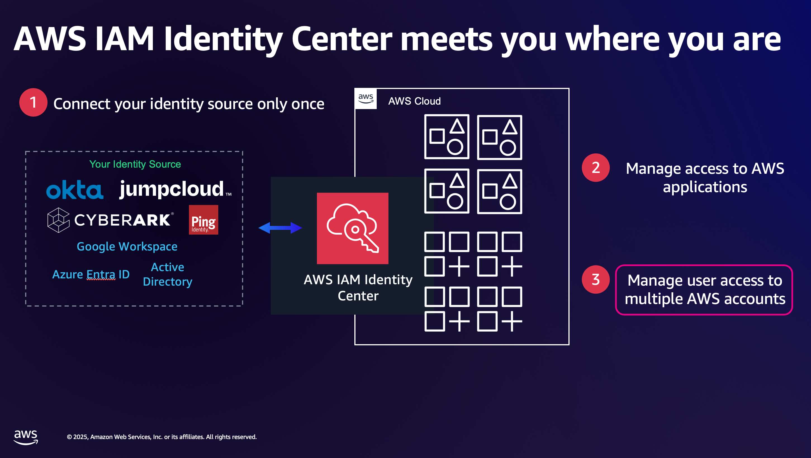
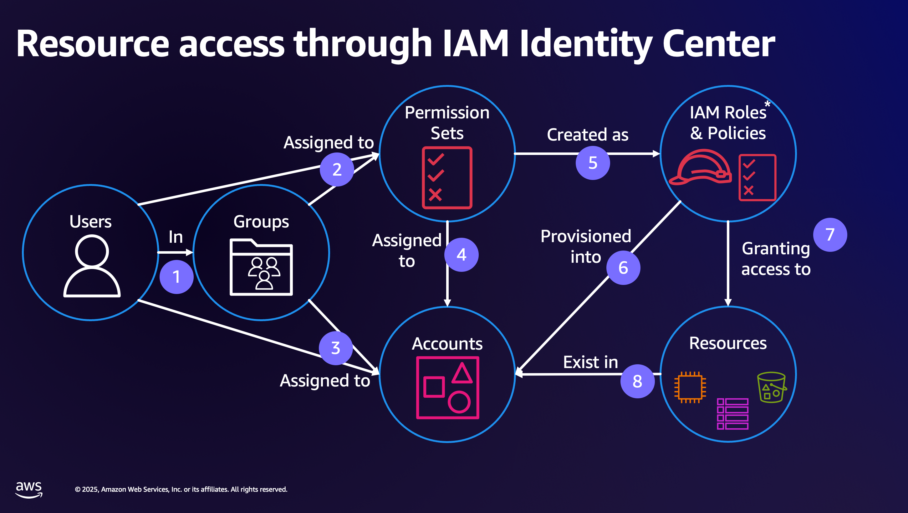
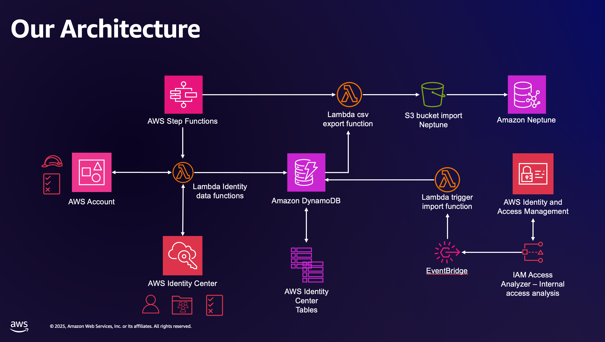
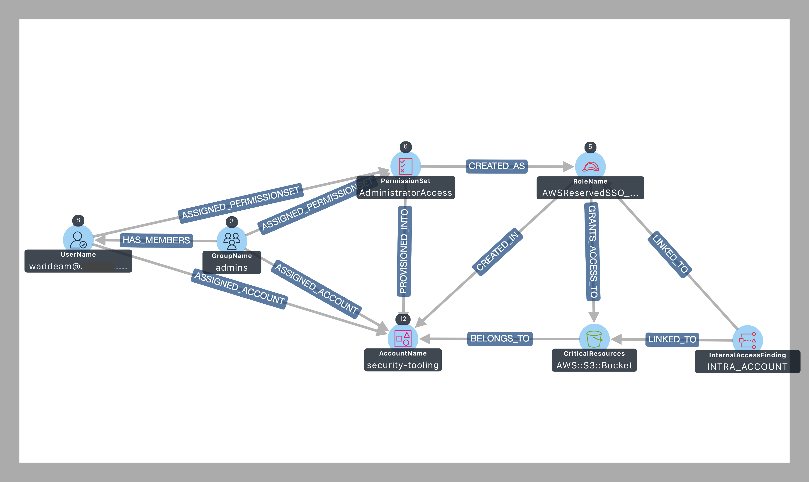

# Overview

[← Back to README](../README.md)

ARIA-gv (Access Rights for Identity on AWS - graph visualization) helps identity
administrators understand and answer questions about who can access what across
their AWS environment.

## The challenge

Customers connect their Identity Provider (IdP) to AWS IAM Identity Center to
manage access to AWS applications and accounts. Users and groups sync from the
IdP into Identity Center and are used to grant access to, for example, AWS
accounts.

That makes access management simpler, but identity teams still get asked
questions like:

- *"Who in our company can access our cloud resources and what can they do to them?"*
- *"Can you show me how Bob was able to update the customer data in our production account?"*
- *"Do users with access to our cloud resources have access rights that follow least privilege?"*
- *"Can you give me a report of everything that Alice has access to in our production account?"*

These are hard to answer because:

- IdP group membership alone does not tell the whole story.
- Resource access can come from a combination of identity-based policies,
  resource-based policies, Service Control Policies (SCPs), Resource Control
  Policies (RCPs), permissions boundaries, and session policies.
- Teams might deploy custom IAM roles and policies into accounts.
- Visibility often needs to extend beyond CloudOps to other teams.

## The approach

ARIA-gv collects identity-related data from AWS, builds the relationships
between entities, and loads it into a graph you can visualize and query.

Data comes primarily from:

- [IAM Identity Center - Identity Store API](https://docs.aws.amazon.com/singlesignon/latest/IdentityStoreAPIReference/welcome.html)
- [IAM Identity Center API](https://docs.aws.amazon.com/singlesignon/latest/APIReference/welcome.html)
- IAM Access Analyzer [Unused Access](https://docs.aws.amazon.com/IAM/latest/UserGuide/access-analyzer-create-unused.html)
  and [Internal Access](https://docs.aws.amazon.com/IAM/latest/UserGuide/access-analyzer-create-internal.html)
  findings (ingested via EventBridge - you must have these analyzers set up).

The solution also builds relationships between entities - for example, which
principals are assigned which permission sets, and which permission sets are
provisioned as IAM roles into each account.

## Architecture

The solution uses AWS Step Functions, AWS Lambda, and Amazon EventBridge to
orchestrate data capture, enrichment, and processing so it can be visualized in
Amazon Neptune Analytics. Amazon DynamoDB stores the data for efficient
processing and to reduce repeated API calls.

## Execution flow

1. **Data collection** - gather identity data from IAM Identity Center.
2. **Data processing** - enrich and store data in DynamoDB.
3. **Graph export** - convert data to Neptune-compatible format.
4. **Visualization** - build an interactive graph in Neptune Analytics.

Here is an example graph visualization, similar to the relationships diagram
above:

Once the graph is built you can explore it visually in Graph Explorer or query
it in plain English - see the [MCP server README](../mcp-server/README.md).

## Important notes

- This solution provides a **snapshot** of access rights at a moment in time,
  based on when the data was acquired from IAM Identity Center, IAM, and IAM
  Access Analyzer.
- It does **not** factor in contextual data from third-party IdPs or IAM trust
  policy statements that may affect access to your critical resources.
